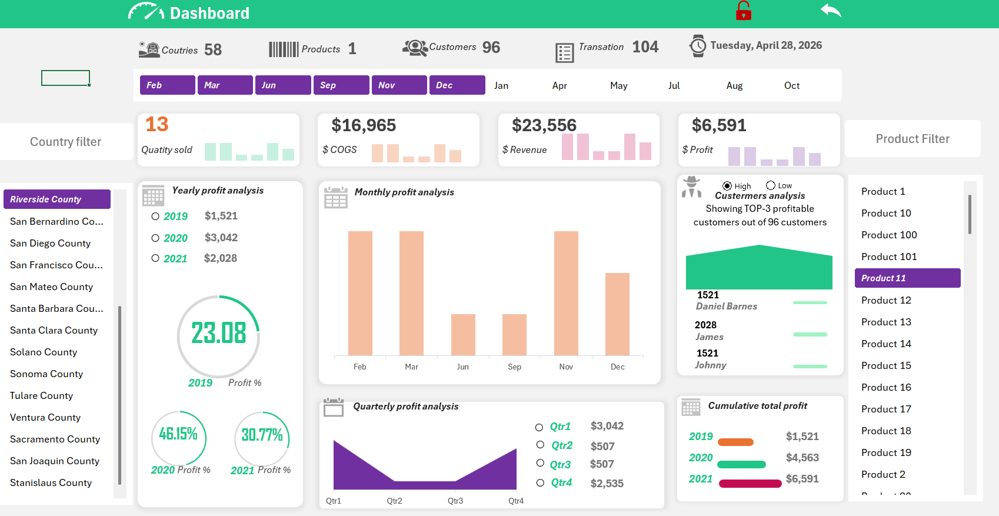

# Sales-Data-Analysis-Project
An interactive sales performance dashboard built using Microsoft Excel.

---
## 📊 Dashboard

## Project Overview
This project is an advanced Excel-based dashboard designed to analyze sales data and transform raw datasets into meaningful and actionable insights. It helps in understanding product performance, regional sales distribution, and overall business performance to support data-driven decision making.

---

## Key Features

- Sales Analysis: Displays total revenue, profit, and quantity sold.
- Fully Interactive Dashboard: Uses slicers to filter data by date, region, and category.
- Key Performance Indicators (KPIs): Tracks performance using advanced visuals such as gauge charts and trend lines.
- Data Modeling: Connects multiple datasets to ensure accuracy and consistency.
- Automation: Uses VBA macros to simplify updates and navigation.

---

## Tools & Technologies

- Microsoft Excel (Core platform)
- Pivot Tables & Pivot Charts for dynamic reporting
- Power Pivot for data modeling and relationships
- Excel Formulas (VLOOKUP, INDEX/MATCH, SUMIFS)
- VBA Macros for automation and interactivity
- Slicers & Timelines for advanced filtering

---

## File Structure

- Dashboard: Main interface containing visuals and KPIs
- Analysis: Supporting calculations and pivot tables (backend layer)
- Data Sheet: Raw sales data used for analysis

---

## How to Use

1. Download the file: `Excel Dashboard for sales.xlsm`
2. Open it using Microsoft Excel
3. Enable Macros to activate full functionality
4. Use slicers to filter and explore the data interactively

---
